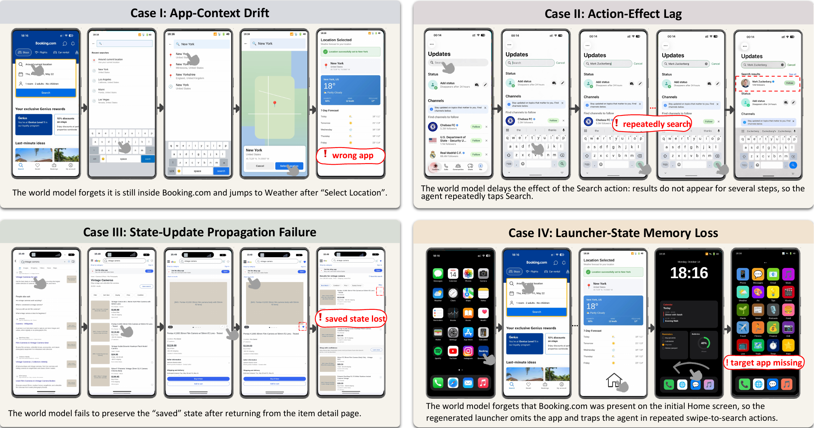
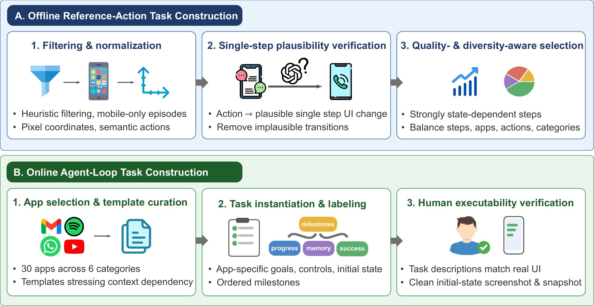

<h1 align="center">
  GUI-CC<br>
  <sub>Benchmarking Contextual Consistency of<br>
  GUI World Models as Agent Environments</sub>
</h1>

<p align="center">
    <a href="https://huggingface.co/datasets/minuzero/GUI-CC">
        
    </a>
    <a href="https://opensource.org/licenses/Apache-2.0">
        
    </a>
    <a href="https://img.shields.io/badge/Data-CC%20BY%204.0-lightgrey.svg">
        
    </a>
    <a href="https://img.shields.io/badge/Python-3.12%2B-blue.svg">
        
    </a>
    <a href="https://img.shields.io/badge/PRs-Welcome-red">
        
    </a>
</p>

<p align="center">
A GUI world model is only useful as an <b>environment</b> if its own predictions stay coherent when
they are fed back as the next state. GUI-CC measures that property, which we call
<b>contextual consistency</b>, instead of scoring next-screen predictions in isolation.
</p>

- 🔁 **Two tracks**: an offline reference-action track (500 trajectories, 4,905 transitions) and an online agent-loop track (200 emulator-verified tasks)
- 📐 **Four dimensions**: transition fidelity, transition plausibility, contextual consistency, and task progress
- 🔌 **Model-agnostic**: any OpenAI-compatible endpoint plugs in; the judge and the probing agent are both swappable

---

## 📢 Updates

- **2026-08:** GUI-CC is accepted to **Findings of EMNLP 2026**.
- **2026-08:** Dataset released on [🤗 Hugging Face](https://huggingface.co/datasets/minuzero/GUI-CC); evaluation code released here.

## 📋 Table of Contents

- [Overview](#-overview)
- [Installation](#️-installation)
- [Dataset](#-dataset)
- [Quick Start](#-quick-start)
- [Evaluation and Metrics](#-evaluation-and-metrics)
- [Adding Your Own World Model](#-adding-your-own-world-model)
- [Citation](#-citation)
- [License](#-license)

## 📖 Overview

<p align="center">
  
</p>

A GUI world model predicts the next interface given the current screenshot and an action. Existing
evaluations score that prediction once, in isolation. But the intended use is multi-step: the
prediction becomes the state the agent acts on next. Under that use, a rollout can look perfectly
plausible frame by frame while the environment has already broken. The figure above shows the four
failure modes GUI-CC is built to expose: app-context drift, action-effect lag, state-update
propagation failure, and launcher-state memory loss.

GUI-CC evaluates a rollout as a whole. A rollout is *contextually consistent* if there is a plausible
latent state sequence under which every predicted screen is a rendering of some state and every
action remains executable on that state.

<p align="center">
  
</p>

**Offline reference-action track.** Starting from a real initial screen, the world model rolls out
autoregressively along a fixed reference action sequence. Reference screenshots are used only for
scoring, never as rollout inputs. 500 trajectories were selected from
[GUI-Odyssey](https://huggingface.co/datasets/OpenGVLab/GUI-Odyssey) by structural filtering,
per-transition plausibility verification, and quality- and diversity-aware selection.

**Online agent-loop track.** A frozen probing GUI agent acts on model-generated screens until the
task completes, the output becomes unusable, or the step budget runs out. 200 tasks across 30 apps
and 18 templates were instantiated and then verified by hand in an Android emulator, each with an
ordered milestone list.

## ⚙️ Installation

One conda environment runs everything: rollout, vLLM serving, generation adapters, and evaluation.

```bash
conda create -n gui-cc python=3.12 pip
conda activate gui-cc
pip install -r requirements.txt
playwright install chromium
```

Chromium is required: HTML/code world models are rendered to PNG through Playwright.

Every machine-local path, endpoint, key, and revision lives in `utils/configs/paths.env`, which is
not tracked:

```bash
cp utils/configs/paths.env.example utils/configs/paths.env
```

At minimum set `OPENAI_BASE_URL` and `OPENAI_API_KEY` for the judge and the probing agent. The
Qwen-Image-Edit example additionally needs a local
[DiffSynth-Studio](https://github.com/modelscope/DiffSynth-Studio) checkout
(`DIFFSYNTH_DIR`) and the model weights (`QWEN_IMAGE_EDIT_2511_DIR`); pin the checkout to the commit
used in the paper, since the pipeline version changes the output pixels:

```bash
git clone https://github.com/modelscope/DiffSynth-Studio.git
git -C DiffSynth-Studio checkout 5bccd60c803e421d5d9ed6b6a449df4a4f17d9e2
```

Verify the installation:

```bash
bash scripts/preflight.sh          # data check, compile, unit tests, shell syntax
python -m pytest -q                # unit tests only
```

## 📦 Dataset

The dataset is hosted separately on Hugging Face. Download it into `data/`, which is where the
harness expects it:

```bash
hf download minuzero/GUI-CC --repo-type dataset --local-dir data
python scripts/validate_data.py    # structure, counts, and image decoding
```

```
data/
├── offline_samples.jsonl        500 lines, one sample per line (line order = sample order)
├── offline_data/<001..500>/
│   ├── reference_trajectory.jsonl
│   ├── initial.png
│   └── step_XXX_after.png
├── online_samples.jsonl         200 lines, one task per line
└── online_data/<001..200>/initial.png
```

Full schema and statistics: [docs/offline.md](docs/offline.md), [docs/online.md](docs/online.md),
and the [dataset card](https://huggingface.co/datasets/minuzero/GUI-CC).

## 🚀 Quick Start

This repository ships two reference world models, one per output modality, plus a generic adapter
for any OpenAI-compatible HTML-generating model. `--subset N` takes a fixed, evenly spaced subset so
a trial run is cheap and its results are reused by the full run.

### Example 1: Code2World (HTML output)

```bash
bash scripts/serve.sh code2world                 # local vLLM on port 4244

python -m offline.rollout --model code2world --setting WM-NoHist --subset 10
python -m offline.cli     --model code2world --setting WM-NoHist --subset 10
```

### Example 2: Qwen-Image-Edit-2511 (direct image output)

```bash
python -m offline.rollout --model qwen_image_edit --setting WM-NoHist --subset 10
python -m offline.cli     --model qwen_image_edit --setting WM-NoHist --subset 10
```

### Example 3: online agent loop

```bash
python -m online.rollout --model code2world --setting WM-NoHist --subset 10
python -m online.cli --rollout-dir outputs/online/code2world/nohist --subset 10
```

### Swapping the judge and the agent

Both default to the model reported in the paper and are overridable at the command line:

```bash
python -m offline.cli --model code2world --setting WM-NoHist \
    --judge-model qwen3.7-plus --base-url https://your-endpoint/v1

python -m online.rollout --model code2world --setting WM-NoHist \
    --planner-model gpt-5.5 --planner-url https://your-endpoint/v1
```

Any OpenAI-compatible vision-language model works as the judge. Scores are comparable only within a
single judge, so keep it fixed across every row of a table.

Two things to watch when you change the judge:

- **Reasoning models.** `--max-tokens` (default 4096, available on both `offline.cli` and
  `online.cli`) is a safety ceiling on one reply, and reasoning tokens count against it. A judge
  that thinks at length can spend the whole budget before emitting any content, which shows up as
  `json_parse_failed` on every request. Raise it for such a judge.
- **Provider-specific request fields.** No extra fields are sent by default. Some providers expose a
  switch to skip a reasoning phase the judge does not need; set `JUDGE_EXTRA_BODY_JSON` in
  `paths.env` to a JSON object to pass such fields through, for example
  `JUDGE_EXTRA_BODY_JSON={"enable_thinking": false}`.

Drop `--subset` to run the full 500 offline samples or 200 online tasks and produce the official
`Overall` score. Then collect both tables:

```bash
python scripts/collect_results.py --split all     # -> outputs/results/{offline,online}.{json,csv}
```

## 📊 Evaluation and Metrics

Offline reports ten metrics, online reports six. All are normalized to `[0, 1]` and reported x100.

| Metric | Dimension | Granularity | Track |
|---|---|---|---|
| `S_ele` Element Alignment | Transition fidelity | Transition | offline |
| `S_lay` Layout Integrity | Transition fidelity | Transition | offline |
| `S_sig` SigLIP similarity | Transition fidelity | Transition | offline |
| `S_dino` DINOv2 similarity | Transition fidelity | Transition | offline |
| `S_ad` Action Adherence | Transition plausibility | Transition | both |
| `S_id` Action Identifiability | Transition plausibility | Transition | both |
| `S_use` GUI State Usability | Transition plausibility | Transition | both |
| `S_cp` State and Context Persistence | Contextual consistency | Trajectory | both |
| `S_rd` Action-Controlled Rollout Dynamics | Contextual consistency | Trajectory | both |
| `S_rap` Reference Action Progress | Task progress | Trajectory | offline |
| `S_mp` Ordered Milestone Progress | Task progress | Trajectory | online |

`S_sig` and `S_dino` are encoder cosine similarities computed locally
(`google/siglip-so400m-patch14-384` and `facebook/dinov2-giant`, configurable through `VISUAL_SIM_*`);
they need no API and can be computed on their own:

```bash
python scripts/run_offline_local_metrics.py --model code2world --setting WM-NoHist
python scripts/run_offline_local_metrics.py --model code2world --setting WM-NoHist --subset 10
```

Samples without a finished rollout are skipped and reported, so this works on a partial run.

Every other metric is scored by a VLM judge with the frozen prompts in `utils/prompts/judge/`.

**Failure attribution.** A model failure (unparseable or empty output) scores 0 for that episode and
stays in the fixed denominator of 500 / 200. An infrastructure failure (timeout, OOM, unreachable
service, browser fault) blocks aggregation instead and has to be fixed and rerun. Agent-side
failures count as infrastructure, because the probing agent is a fixed component shared by every
world model under test.

## 🔌 Adding Your Own World Model

**If it is served over an OpenAI-compatible API**, no code is needed. Add an entry to
`utils/configs/offline.json` with `"adapter": "closed_html"` and point it at your endpoint, or
override an existing row:

```bash
python -m offline.rollout --model gpt55 --setting WM-NoHist \
    --served-model your-model-name --endpoint https://your-endpoint/v1 \
    --output-root outputs/offline/predictions
```

**Otherwise**, subclass one of the two base adapters and register it in
`utils/adapters/registry.py`:

| Base | For | You implement |
|---|---|---|
| `utils/adapters/base.py` | models that emit HTML | `build_messages()`, optionally `parse_output()` |
| `utils/adapters/diffusion_base.py` | models that emit images | `load_model()`, `build_prompt()`, `generate()`, `target_hw()` |

`code2world_adapter.py` and `qwen_image_edit_adapter.py` are the reference implementations. The base
classes already handle request fingerprinting, caching, resizing back to the sample's native
resolution, and failure attribution.

### If your world model is natively multi-step

The two settings describe **what the harness feeds the model at each step, not what the model is**:

| Setting | The harness passes |
|---|---|
| `WM-NoHist` | only the current screen and the current action |
| `WM-FullHist` | additionally, the configured window of recent (state, action) pairs |

Every world model evaluated in the paper consumes one step at a time, so `WM-FullHist` exists as a
harness-side condition that supplies the context those models cannot carry themselves. It is a
control, not a claim about the model.

If your model already carries state across steps, do not use `WM-FullHist` to simulate that. Run it
under `WM-NoHist` and let it work the way it was designed: the harness calls `predict()` once per
step in trajectory order on the same adapter instance, so your adapter can keep whatever state it
needs on `self` (a KV cache, a running summary, a session handle) and ignore the `history` argument.
That is the more faithful evaluation, and it is what the benchmark is meant to measure.

Declare only the settings you support in `utils/configs/{offline,online}.json`; a model that needs
just one row lists a single entry in `settings`.

## 📄 Citation

```bibtex
@misc{fu2026guiccbenchmarkingcontextualconsistency,
      title={GUI-CC: Benchmarking Contextual Consistency of GUI World Models as Agent Environments}, 
      author={Lin Fu and Zheyuan Yang and Tianhui Zhang and Jinbiao Wei and Guo Gan and Boxu Liu and Yilun Zhao and Yu Rong},
      year={2026},
      eprint={2609.00048},
      archivePrefix={arXiv},
      primaryClass={cs.CL},
      url={https://arxiv.org/abs/2609.00048}, 
}
```

The offline track is derived from GUI-Odyssey; please cite it as well:

```bibtex
@misc{lu2025guiodysseycomprehensivedatasetcrossapp,
      title={GUIOdyssey: A Comprehensive Dataset for Cross-App GUI Navigation on Mobile Devices}, 
      author={Quanfeng Lu and Wenqi Shao and Zitao Liu and Lingxiao Du and Fanqing Meng and Boxuan Li and Botong Chen and Siyuan Huang and Kaipeng Zhang and Ping Luo},
      year={2025},
      eprint={2406.08451},
      archivePrefix={arXiv},
      primaryClass={cs.CV},
      url={https://arxiv.org/abs/2406.08451}, 
}
```

## 📜 License

Code in this repository is released under the [Apache License 2.0](LICENSE).

The dataset is distributed separately under CC BY 4.0, matching
[GUI-Odyssey](https://huggingface.co/datasets/OpenGVLab/GUI-Odyssey), from which the offline track is
derived. The online screenshots were captured across 30 real applications whose interfaces,
trademarks, and content remain the property of their respective owners; they are provided for
non-commercial research use only. See the
[dataset card](https://huggingface.co/datasets/minuzero/GUI-CC) for details.
